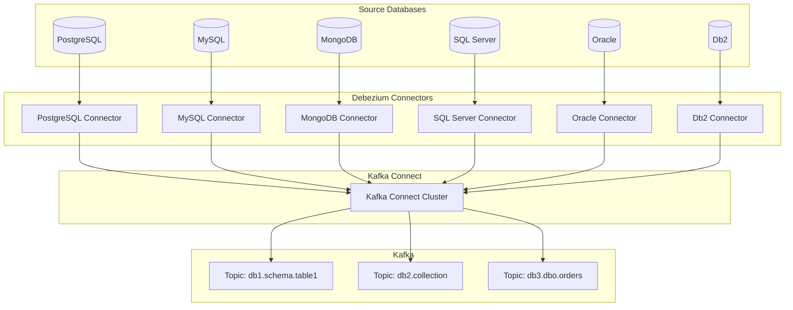

Yes, **Debezium is completely free and open-source**! Let me break down the licensing and cost structure for you.
Great question! **Debezium is completely data provider agnostic** - it's not limited to PostgreSQL at all. Debezium is a comprehensive change data capture (CDC) platform that supports multiple database systems.

## Supported Database Connectors

Debezium provides connectors for various databases:

### **Stable Production Connectors:**
- **PostgreSQL** - Uses logical replication and pgoutput plugin
- **MySQL** - Uses binlog for change capture
- **MongoDB** - Uses replica set oplog or change streams
- **SQL Server** - Uses SQL Server Agent and transaction log
- **Oracle** - Uses LogMiner or XStream (requires license)
- **Db2** - Uses SQL replication and ASN capture

### **Incubating/Community Connectors:**
- **Cassandra** - Uses CommitLog reader
- **Vitess** - Uses VTGate streams
- **Spanner** - Uses change streams API

## Architecture Overview



## Database-Specific Implementation Examples

### **MySQL Connector Configuration**
```json
{
  "name": "mysql-connector",
  "config": {
    "connector.class": "io.debezium.connector.mysql.MySqlConnector",
    "database.hostname": "mysql-server",
    "database.port": "3306",
    "database.user": "debezium",
    "database.password": "password",
    "database.server.id": "184054",
    "topic.prefix": "ecommerce-mysql",
    "table.include.list": "inventory.customers,inventory.orders",
    "schema.history.internal.kafka.topic": "schema-changes.inventory"
  }
}
```

### **MongoDB Connector Configuration**
```json
{
  "name": "mongodb-connector",
  "config": {
    "connector.class": "io.debezium.connector.mongodb.MongoDbConnector",
    "mongodb.connection.string": "mongodb://mongo1:27017,mongo2:27017,mongo3:27017/?replicaSet=rs0",
    "topic.prefix": "ecommerce-mongo",
    "collection.include.list": "inventory.customers,inventory.orders"
  }
}
```

### **SQL Server Connector Configuration**
```json
{
  "name": "sqlserver-connector",
  "config": {
    "connector.class": "io.debezium.connector.sqlserver.SqlServerConnector",
    "database.hostname": "sqlserver",
    "database.port": "1433",
    "database.user": "sa",
    "database.password": "Password!",
    "database.dbname": "ecommerce",
    "topic.prefix": "ecommerce-sqlserver",
    "table.include.list": "dbo.customers,dbo.orders"
  }
}
```

## Multi-Database Integration Scenario

You could easily extend our PostgreSQL → Kafka → Salesforce POC to support multiple databases:

```yaml
# Multi-database Docker Compose
version: '3.9'
services:
  # PostgreSQL
  postgres:
    image: postgres:15
    environment:
      POSTGRES_DB: ecommerce_pg
    command: ['postgres', '-c', 'wal_level=logical']
  
  # MySQL
  mysql:
    image: mysql:8.0
    environment:
      MYSQL_ROOT_PASSWORD: password
      MYSQL_DATABASE: ecommerce_mysql
    command: ['mysqld', '--log-bin=mysql-bin', '--binlog-format=ROW']
  
  # MongoDB
  mongodb:
    image: mongo:5.0
    command: ['mongod', '--replSet', 'rs0']
  
  # Debezium Connect (supports all connectors)
  debezium-connect:
    image: debezium/connect:2.4
    environment:
      BOOTSTRAP_SERVERS: kafka:9092
      # Same Connect cluster handles all database types
```

## Database-Agnostic Consumer Application

Your Salesforce integration consumer can handle events from any database:

```python
class UniversalDatabaseConsumer:
    def __init__(self, kafka_servers, salesforce_publisher):
        # Subscribe to all database topics
        self.consumer = KafkaConsumer(
            'ecommerce-postgres.inventory.customers',
            'ecommerce-mysql.inventory.customers', 
            'ecommerce-mongo.inventory.customers',
            'ecommerce-sqlserver.dbo.customers',
            bootstrap_servers=kafka_servers
        )
        self.sf_publisher = salesforce_publisher
    
    def process_message(self, message):
        # Universal message processing
        source_db = self.identify_source_database(message.topic)
        transformed_data = self.transform_for_salesforce(message.value, source_db)
        self.sf_publisher.publish_platform_event(transformed_data)
    
    def identify_source_database(self, topic):
        if 'postgres' in topic:
            return 'PostgreSQL'
        elif 'mysql' in topic:
            return 'MySQL'
        elif 'mongo' in topic:
            return 'MongoDB'
        elif 'sqlserver' in topic:
            return 'SQL Server'
```

## Key Benefits of Database Agnosticism

1. **Unified CDC Platform**: Single tool for all your database CDC needs
2. **Consistent Message Format**: Standardized event structure across databases
3. **Simplified Operations**: One platform to learn, deploy, and maintain
4. **Hybrid Architecture Support**: Mix different databases in the same data pipeline
5. **Migration Flexibility**: Easy to migrate between database systems

## Database-Specific Considerations

Each connector has unique capabilities:

| Database | CDC Method | Special Features |
|----------|------------|------------------|
| PostgreSQL | Logical replication | Full JSONB support, custom plugins |
| MySQL | Binary log | GTID support, multi-source replication |
| MongoDB | Oplog/Change Streams | Document-level changes, sharding support |
| SQL Server | Transaction log | Always On AG support, snapshot isolation |
| Oracle | LogMiner/XStream | RAC support, supplemental logging |

So to answer your question directly: **Debezium is completely database agnostic** and our Salesforce integration architecture would work identically regardless of whether your source system is PostgreSQL, MySQL, MongoDB, SQL Server, or any other supported database. The beauty of the CDC → Kafka → Salesforce pattern is that it abstracts away the source database specifics!
## Debezium Licensing

### **Core Platform**
- **License**: Apache License 2.0
- **Cost**: Completely free
- **Source Code**: Fully available on GitHub
- **Commercial Use**: Permitted without restrictions
- **Modification**: Allowed and encouraged

### **GitHub Repository**
- **Main Repository**: https://github.com/debezium/debezium
- **Active Development**: Regular commits and releases
- **Community**: 6,000+ stars, 2,500+ forks
- **Contributors**: 200+ active contributors

## What's Included (Free)

### **All Database Connectors**
```
✅ PostgreSQL Connector - FREE
✅ MySQL Connector - FREE  
✅ MongoDB Connector - FREE
✅ SQL Server Connector - FREE
✅ Oracle Connector - FREE*
✅ Db2 Connector - FREE
✅ Cassandra Connector - FREE
✅ Vitess Connector - FREE
```

### **Complete Infrastructure**
- Kafka Connect framework integration
- Message transformation capabilities
- Schema evolution handling
- Monitoring and metrics (JMX)
- Docker images and Kubernetes operators
- Comprehensive documentation

## Enterprise vs Open Source

| Component | Open Source | Enterprise |
|-----------|-------------|------------|
| **Core Debezium** | ✅ Free | ✅ Included |
| **All Connectors** | ✅ Free | ✅ Included |
| **Basic Support** | Community | 24/7 Premium |
| **Advanced Monitoring** | Basic JMX | Enhanced Tools |
| **Professional Services** | ❌ | ✅ Available |

## Commercial Distributions

While Debezium itself is free, some companies offer enterprise distributions:

### **Red Hat Integration**
- **Product**: Red Hat Integration (includes Debezium)
- **Licensing**: Subscription-based
- **Value-Add**: 
  - Enterprise support
  - Long-term maintenance
  - Integration with Red Hat ecosystem
  - Professional services

### **Confluent Platform**
- **Product**: Confluent Platform
- **Debezium**: Available as connector
- **Licensing**: Community (free) or Enterprise (paid)
- **Value-Add**:
  - Confluent Control Center
  - Schema Registry
  - ksqlDB integration

## Oracle Connector Considerations*

**Important Note**: While the Oracle connector itself is free and open-source, **Oracle database licensing** may have implications:

- **Oracle License**: You need proper Oracle DB licenses
- **Oracle Features**: Some advanced features may require additional Oracle licensing
- **LogMiner vs XStream**: XStream requires Oracle GoldenGate license

## Self-Hosted Deployment Costs

### **Infrastructure Costs Only**
```yaml
# Typical self-hosted setup costs:
Infrastructure:
  - Kafka Cluster: 3 nodes (cloud VMs)
  - PostgreSQL: 1 database server
  - Debezium Connect: 2-3 workers
  - Monitoring: Prometheus/Grafana

Software Licensing:
  - Debezium: $0 (FREE)
  - Kafka: $0 (Apache Kafka is free)
  - PostgreSQL: $0 (FREE)
  - Monitoring Stack: $0 (FREE)

Total Software Cost: $0
Only Infrastructure/Cloud Costs Apply
```

## Comparison with Commercial CDC Tools

| Tool | Licensing | Typical Cost |
|------|-----------|--------------|
| **Debezium** | Open Source | FREE |
| Oracle GoldenGate | Commercial | $17,500-$47,500/processor |
| IBM InfoSphere CDC | Commercial | $13,000-$25,000/PVU |
| Microsoft CDC | Included with SQL Server | Varies with SQL license |
| Attunity Replicate | Commercial | $15,000-$30,000/server |

## Getting Started (Zero Cost)

You can start immediately with our POC using only free components:

```bash
# Clone Debezium examples
git clone https://github.com/debezium/debezium-examples.git

# Deploy with Docker (all free images)
docker-compose up -d

# Components included:
# - Debezium Connect (FREE)
# - Apache Kafka (FREE)
# - PostgreSQL (FREE)
# - Zookeeper (FREE)
```

## Cost Benefits of Open Source Approach

### **Direct Savings**
- **No licensing fees**: Save $15,000-$50,000+ per year vs commercial CDC tools
- **No vendor lock-in**: Freedom to modify and extend
- **Transparent roadmap**: Community-driven development

### **Operational Benefits**
- **Large community**: Extensive documentation and examples
- **Regular updates**: Active development and bug fixes
- **Ecosystem integration**: Works with any Kafka-compatible system

## Support Options

### **Free Community Support**
- GitHub issues and discussions
- Stack Overflow community
- Debezium mailing lists
- Comprehensive documentation

### **Paid Support Available**
- Red Hat commercial support
- Third-party consulting services
- Custom development services

## Summary

**Debezium is 100% free and open-source** with Apache 2.0 licensing. You can:

✅ Use it commercially without restrictions  
✅ Modify the source code  
✅ Deploy at any scale  
✅ Integrate with any system  
✅ Access all database connectors  

The only costs involved are your infrastructure (servers, cloud resources) and optional paid support if desired. This makes it an extremely cost-effective solution compared to commercial CDC alternatives that can cost tens of thousands of dollars annually.

For our PostgreSQL → Kafka → Salesforce integration POC, **every component can be deployed completely free of charge**!
