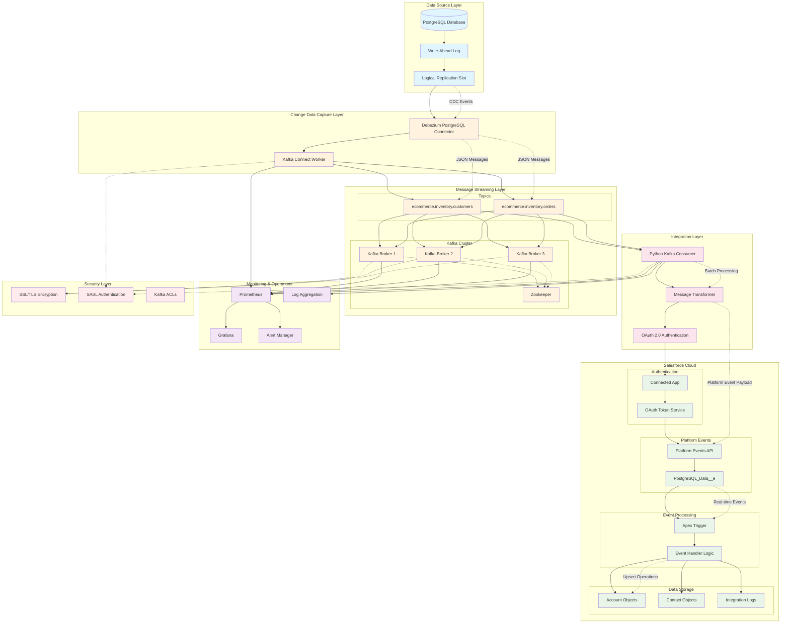

I'll create a comprehensive Mermaid diagram that visualizes the complete architecture of the PostgreSQL → Kafka → Salesforce Platform Events integration scenario.Perfect! I've created a comprehensive Mermaid diagram that visualizes the complete architecture of the PostgreSQL → Kafka → Salesforce Platform Events integration scenario.

## Architecture Diagram Components

The diagram illustrates the following key layers and components:

### **Data Source Layer**
- PostgreSQL database with Write-Ahead Logging (WAL)
- Logical replication slot for CDC

### **Change Data Capture Layer** 
- Debezium PostgreSQL connector
- Kafka Connect worker for managing connectors

### **Message Streaming Layer**
- 3-node Kafka cluster with Zookeeper coordination
- Dedicated topics for customers and orders tables
- Built-in replication across brokers

### **Integration Layer**
- Python Kafka consumer application
- Message transformation logic
- OAuth 2.0 authentication handling

### **Salesforce Cloud**
- Connected App for secure API access
- Platform Events API for event publishing
- Apex triggers for event consumption
- Custom objects for data storage

### **Monitoring & Operations**
- Prometheus for metrics collection
- Grafana for visualization
- Alert Manager for notifications
- Log aggregation for troubleshooting

### **Security Layer**
- SSL/TLS encryption for data in transit
- SASL authentication for Kafka access
- ACLs for fine-grained permissions

## Data Flow Visualization

The diagram shows the complete data flow:
1. **PostgreSQL** generates change events via WAL
2. **Debezium** captures CDC events and publishes to Kafka topics
3. **Kafka** distributes messages across broker cluster
4. **Python Consumer** processes messages and transforms for Salesforce
5. **Platform Events API** receives and distributes events in Salesforce
6. **Apex Triggers** consume events and update Salesforce objects

The color-coded components make it easy to understand the different architectural layers and their interactions. This diagram serves as an excellent reference for understanding the complete integration architecture and can be used for documentation, presentations, and team discussions.

